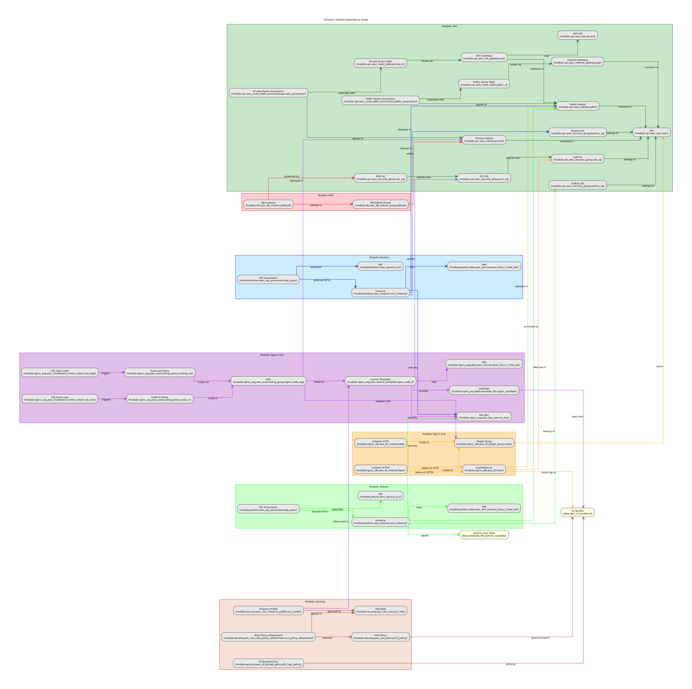

# Scalable Multi-Tier Web Application on AWS

This repository deploys a scalable, secure, and highly available multi-tier web application on AWS using Terraform. The solution leverages modular Terraform code, remote state management, and advanced AWS services.

## Architecture Overview

The following diagram illustrates the core architecture:



### Key Points

- **Networking**: A dedicated VPC with public and private subnets. Public subnets connect to the Internet Gateway while private subnets use a NAT Gateway.
- **Compute**: The ALB distributes incoming traffic to an Auto Scaling Group of EC2 instances running Nginx.
- **Database**: A secure, Multi-AZ RDS MySQL instance accessible only from the private subnets.
- **Security**: Configured through IAM roles, security groups, and remote state management using S3 and DynamoDB.
- **Bastion Host**: A dedicated bastion (jump box) is deployed in a public subnet. **This host is used for debugging and troubleshooting** by allowing you to securely SSH into private EC2 instances without exposing them directly to the internet.
- **Jenkins CI/CD**: A Jenkins server (also deployed as an EC2 instance) orchestrates deployments using Terraform. The server securely injects sensitive data (like SSH keys) as secrets during pipeline runs.

## Module Structure

The project is organized into several reusable Terraform modules, each responsible for a specific area of the architecture:


- **VPC Module**:
  - Creates the VPC, subnets (public and private), Internet and NAT Gateways, and routing configurations.
- **ALB Module**:
  - Sets up the Application Load Balancer with conditional HTTP/HTTPS listeners, target groups, and access logging.
- **ASG Module**:
  - Deploys an Auto Scaling Group of EC2 instances using a launch template. The launch template bootstraps Nginx via a user data script, pulling assets from S3.
- **RDS Module**:
  - Provisions a secure, Multi-AZ RDS MySQL instance along with its subnet group.
- **S3 Module**:
  - Configures IAM roles, policies, and instance profiles for EC2 instances. It also sets bucket policies for ALB log storage.
- **Security Module**:
  - Deploys a bastion host in a public subnet to enable secure SSH access into private resources for debugging.
- **Bastion Module**:
  - Deploys a Jenkins server (using a slightly larger EC2 instance type) that runs the CI/CD pipelines. The Jenkins instance also receives injected user data and credentials via secure secrets.

## Getting Started

### Prerequisites

- **Terraform**: [Download & install](https://www.terraform.io/downloads)
- **AWS CLI**: [Setup & configure](https://aws.amazon.com/cli/)
- **AWS Account**:
  - Ensure your account has the required permissions.
- **Backend Setup**:
  - Create an S3 bucket and DynamoDB table for Terraform state management.
- **SSH Public Key**:
  - Ensure you have your local public key (typically located at `~/.ssh/id_rsa.pub`). This key is used to create an AWS key pair that allows secure SSH access to instances (injected as a secret into the Jenkins pipeline).
- **Assets Bucket**:
  - Create (or reference) an S3 bucket to store Terraform artifacts and HTML files for Nginx. This bucket is defined via the s3_bucket_name variable and must reside in the same region as the VPC.

## Deployment Steps

1. **Initialize Terraform:**

```bash
terraform init
```

2. **Plan the Deployment**:

```bash
terraform plan
```

3. **Apply the Configuration**:

```bash
terraform apply
```

4. **Review Outputs**:

   - Key outputs include the ALB DNS name, ASG details, RDS endpoint, and Bastion Host public IP.

## Debugging & SSH Access

- **Bastion Host Access**:

  - The bastion host is deployed in a public subnet and is intended for debugging purposes. You can SSH into the bastion host using your key pair. From the bastion host, you can then SSH into your private EC2 instances using their private IPs.

- **Example SSH Workflow**:

1. SSH into the bastion host:

```bash
ssh -A -i ~/.ssh/id_rsa ec2-user@<bastion_public_ip>
```

2. From the bastion host, connect to a private instance:

```bash
ssh ec2-user@<private_instance_ip>
```

3. Troubleshooting 502 Errors:
   - A 502 Bad Gateway error from the ALB indicates that the backend (EC2) instances are not responding correctly. Check:
   - Target group health checks and instance status.
   - Nginx service on the instances.
   - That the user data script executed successfully (for bootstrapping Nginx and copying web files).

## Jenkins Setup

The Jenkins server is deployed as part of the infrastructure and is used to orchestrate Terraform deployments via pipelines.

1. **Access Jenkins**:

   - SSH into the Jenkins server:

```bash
ssh -i ~/.ssh/id_rsa ec2-user@<jenkins_public_ip>
```

    - Retrieve the initial admin password:

```bash
cat /var/lib/jenkins/secrets/initialAdminPassword
```

2.  Connect via Browser:

    - Open: `http://<jenkins_public_ip>:8080`

3.  Configure Jenkins:

    - Create an Admin user.
    - Install required plugins including the `AWS Credentials Plugin`.
    - Define a pipeline that pulls the Terraform code from this repository (e.g., using `ci/cd.Jenkinsfile`).

4.  SSH Key Injection:

    - The Jenkins pipeline securely injects your SSH public key (stored as a secret under the ID s`sh_rsa_pub`) into the workspace so Terraform can create the key pair without referencing a local file path.

```jenkins
stage('Prepare SSH Key') {
    steps {
        withCredentials([string(credentialsId: 'ssh_rsa_pub', variable: 'SSH_RSA_PUB')]) {
            sh 'echo "$SSH_RSA_PUB" > ${WORKSPACE}/id_rsa.pub'
        }
    }
}
// Terraform commands then reference the file via -var "public_key_path=${WORKSPACE}/id_rsa.pub"
```


## Troubleshooting & Tips

- **State Management**:
  - Verify that your S3 bucket and DynamoDB table for remote state are properly configured.
- **Scaling**:
  - Adjust the Auto Scaling Group parameters based on application load.
- **Security**:
  - Follow least-privilege principles when configuring IAM roles and security groups.
- **Bastion Host**:
  - Use the bastion host to troubleshoot and debug issues by connecting to your private instances without exposing them directly.

## Deployment Preview

### VPC Resource Map:


- VPC (10.0.0.0/16)
  - 2 Private Subnets (10.0.3.0/24, 10.0.4.0/24)
  - 2 Public Subnets (10.0.1.0/24, 10.0.2.0/24)
  - Internet Gateway (igw-multitier-app-vpc)
  - NAT Gateway (nat-multitier-app-vpc)
  - Route Tables
    - Private (private-rt-multitier-app-vpc)
    - Public (public-rt-multitier-app-vpc)

### ALB Resource Map:


- ALB (multitier-app-alb)
  - Listener (HTTP, HTTPS)
  - Target Group (multitier-app-tg)
  - Targets (multitier-app-nginx-lt-instance)

### EC2 Instances:


- Nginx Web Server (multitier-app-nginx-lt-instance)
- Bastion Instance (bastion)

### Serving Page


